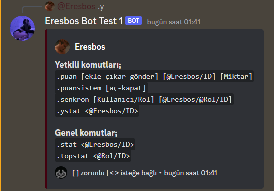
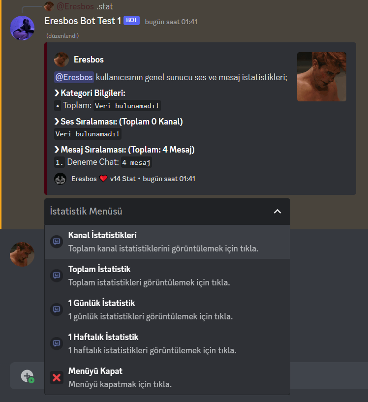
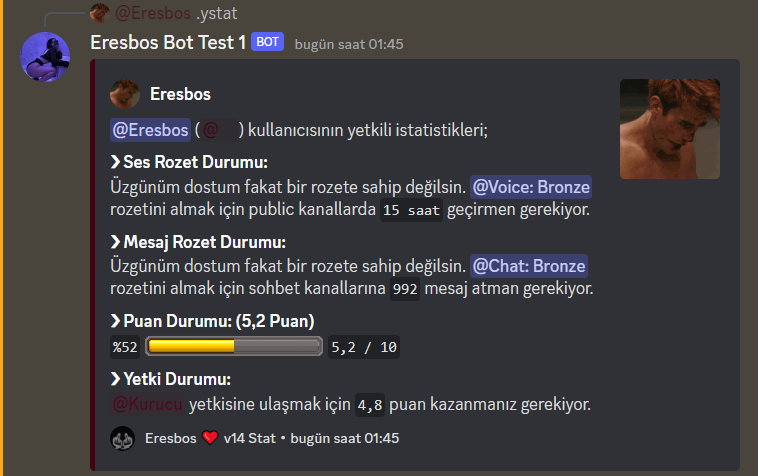
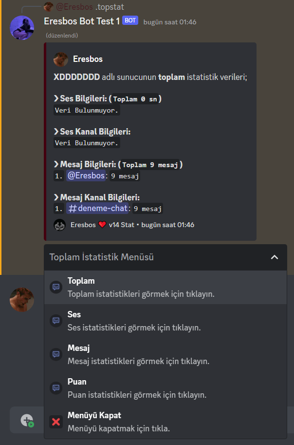
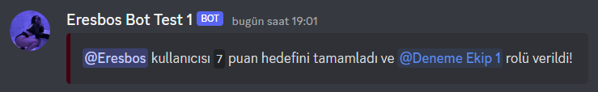
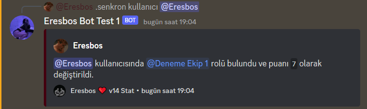
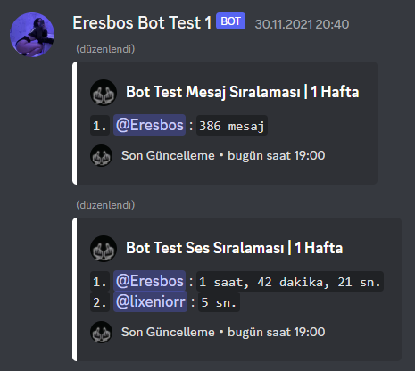
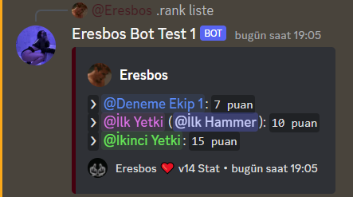
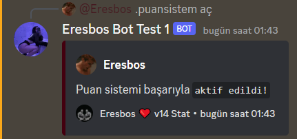
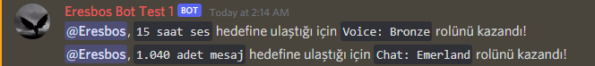

# Discord Advanced Stat Bot

- [Advanced Stat bot](#discord-advanced-stat-bot)
  - [Kurulum](#kurulum)
  - [Özellikler](#özellikler)
  - [Görseller](#görseller)
  - [İletişim](#i̇letişim)

# Kurulum
* İlk olarak bilgisayarına [Node JS](https://nodejs.org/tr/) indir.
* Daha sonra bir [MongoDB](http://mongodb.com) hesabı oluştur ve connection linki al.
* Bu projeyi zip halinde indir.
* Herhangi bir klasöre zipi çıkart.
* Daha sonra src klasörünün içindeki configs klasörünün içine gir `settings.json` ve `config.json` dosyalarının içindeki bilgileri doldur.
* Sonra klasörün içerisinde bir `powershell` ya da `cmd` penceresi aç.
* ```npm install``` yazarak tüm modülleri kur.
* Kurulum bittikten sonra ```npm start``` yaz ve botu başlat.

# Not
* `"./src/emojis"` klasörü altında kullanılan ve lazım olacak emojiler verilmiştir. Sunucunuza yükleyip `"./src/configs/config.json.example"` dosyasındaki örneklere göre kullanabilirsiniz.

# Özellikler
- [x] **İstatistik Sistemi**
- [x] **Rozet Sistemi**
- [x] **Lider Tablosu Sistemi**
- [x] **Puanla Rütbe Atlama Sistemi**
- [x] **Gelişmiş Menü Sistemi**
- [ ] **Görev Sistemi**

# Görseller:











# İletişim
* [Web Sitem](https://eresbos.dev)
* [Discord Sunucum](https://discord.gg/ZS2TKFFadZ)
* [Discord Profilim](https://discord.com/users/350976460313329665)
* Herhangi bir hata bulmanız durumunda ya da yardım isteyeceğiniz zaman buralardan bana ulaşabilirsiniz.

### NOT: Botta MIT lisansı bulunmaktadır. Bu botun dosyalarının benden habersiz paylaşılması/satılması durumunda gerekli işlemler yapılacaktır!
